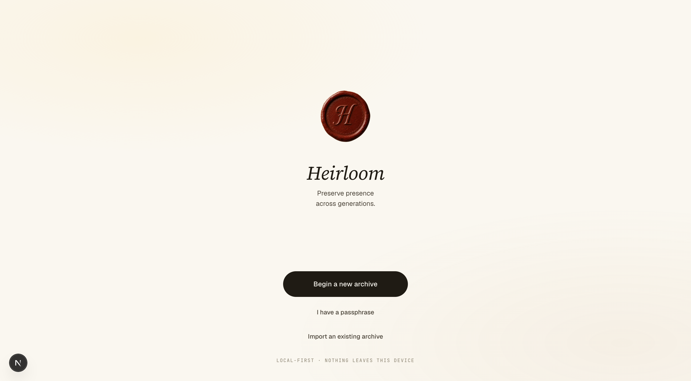
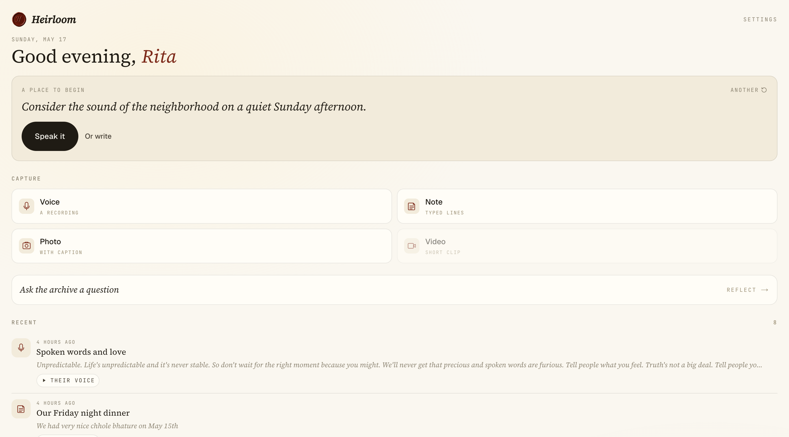
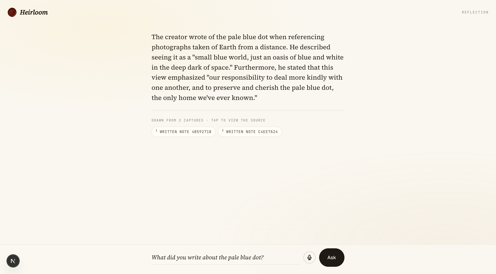
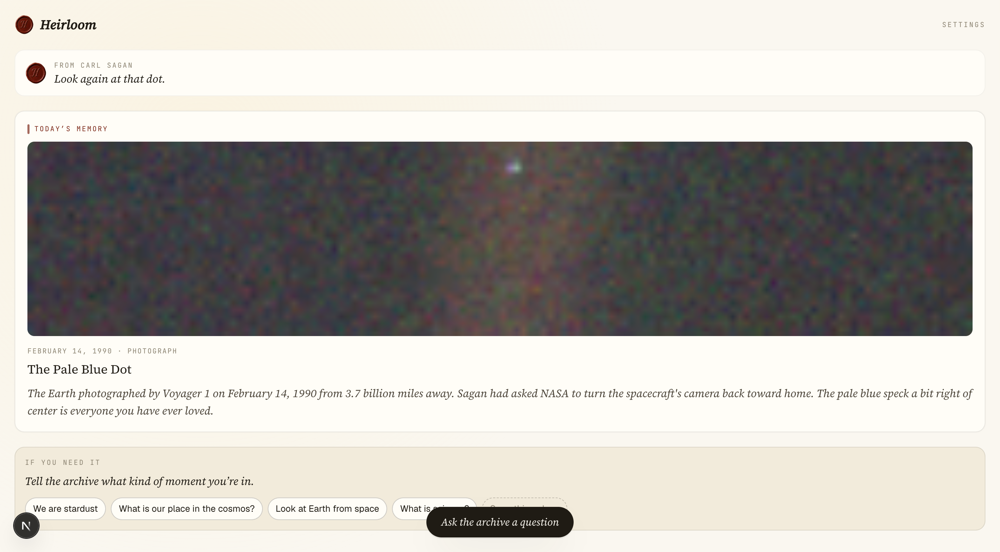
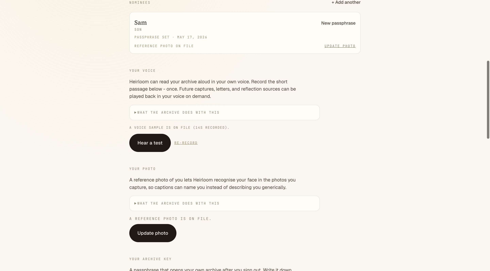
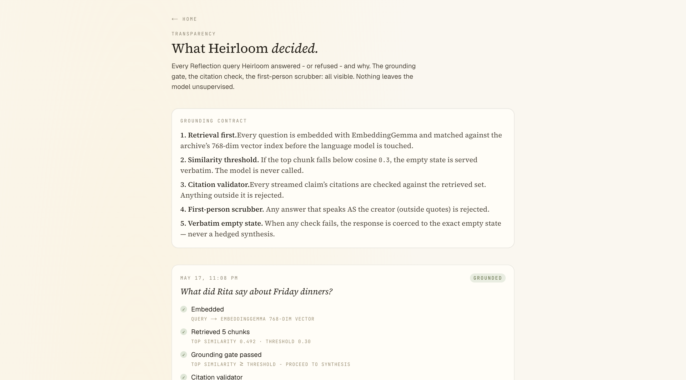
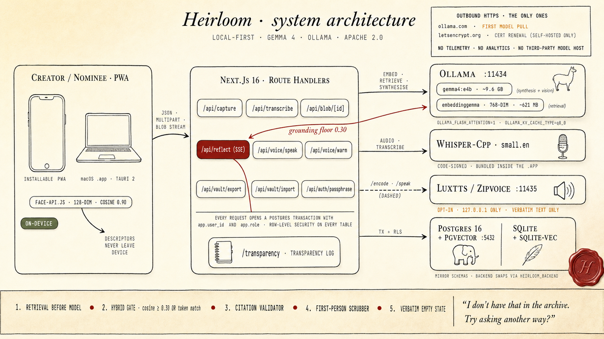

<div align="center">
  

# Heirloom

*Preserve presence across generations.*

</div>

---

Heirloom holds what someone wanted to leave behind. Voice, photographs,
letters, the things a person actually said, kept in a private archive
that the people they love can come back to in their own time. Everything
runs on the creator's own device. Nothing leaves it.

## Contents

- [What this is, and what it isn't](#what-this-is-and-what-it-isnt)
- [A walk through the archive](#a-walk-through-the-archive)
- [Features](#features)
- [The grounding contract](#the-grounding-contract)
- [Try Heirloom](#try-heirloom)
- [Architecture](#architecture)
- [Documentation](#documentation)
- [License](#license)

---

## What this is, and what it isn't

A memory archive for people who want to leave something specific behind
for someone specific. A grandparent recording stories, a parent writing
letters for moments that haven't arrived, a partner setting aside
sentences they meant to say out loud.

The creator makes the archive while they are alive and well. They
decide what goes in and who it is for. The recipient (a *nominee*)
receives access on the creator's terms, on hardware they own.

### What this is not

- **Not a chatbot pretending to be a person.** The synthesis model is
  never given license to speak as the creator. Every answer is grounded
  in something the creator actually wrote, said, or photographed;
  uncited claims and first-person impersonation fail closed to a
  verbatim *"I don't have that in the archive"* response.
- **Not a digital resurrection.** Voice cloning is opt-in and only
  ever speaks text the creator already wrote. There is no free-form
  *"speak this for me"* affordance.
- **Not a grief loop.** No streaks, no engagement notifications. The
  archive is available; it never asks. People come back when they want
  to, not because an app pulled them in.
- **Not in a cloud.** No telemetry, no managed inference, no
  third-party model providers. Heirloom installs on the creator's own
  laptop or a Mac mini the family owns.

Long-form treatment in
[`docs/ETHICS-AND-DESIGN.md`](./docs/ETHICS-AND-DESIGN.md).

---

## A walk through the archive

### Begin or come back



Three doors. *Begin a new archive* mints a fresh creator and shows a
four-word passphrase. *I have a passphrase* re-opens an archive after
signing out. *Import an existing archive* takes a `.hloom` bundle from
someone else and unlocks it locally.

### The creator's home



A daily prompt generated against the creator's identity index, four
capture surfaces (voice, note, photo, video), one line to ask the
archive a question, and a recent feed.

### Capture

A note is a paragraph. A voice memo is a take, transcribed by Whisper,
chunked and embedded for retrieval, original audio preserved for
playback. A photo is captioned by Gemma 4 vision in the archival third
person; if a face matches someone the creator has named, the caption
uses that name.

### Reflect



A question is embedded, matched against the vault's vector index, and
the language model is only allowed to speak when retrieval has found
something to point at. Every answer carries citation chips that open
the source verbatim. Where the source was a voice recording, it plays
back in the creator's actual voice.

### The nominee's home



A different surface. No capture composer. A daily memory hero pulled
from what's been released, a row of mood chips that can quietly unlock
sealed letters, and the same grounded Reflect.

### Settings



Editable for the creator: name, anchor dates, nominees, voice profile,
reference photo, archive key, notifications, encrypted vault export
and import. Nominees see a smaller version with notifications and
sign-out only.

### Transparency



Every Reflection (answered or refused) is logged with its diagnostics:
the chunks retrieved, the similarity scores, and the reason the model
spoke or didn't.

---

## Features

Everything below works offline, on a laptop, with no external API.

### Capture

- **Notes** with auto-generated titles. Gemma 4 reads the body once
  saved and proposes a calm headline; the creator can override.
- **Voice memos** transcribed by `whisper-cpp small.en`, segment-aligned,
  chunked, embedded into pgvector for retrieval.
- **Photos** captioned by Gemma 4 vision in third person; identity-aware
  when a face matches a known person.
- **Drafts** persist locally in IndexedDB if the network drops
  mid-capture.

### Identity awareness

- Face detection runs in the browser via `face-api.js`. The 128-dim
  descriptors never leave the device unencrypted.
- Strict match threshold: cosine ≥ `0.90` before a face is linked to a
  known person. Look-alikes (0.5 to 0.7) stay unlabeled.
- Self-healing captions: if a threshold change drops a face link, the
  affected captions re-render automatically without the wrong name.

### Voice

- **Voice cloning, offline.** LuxTTS (a ZipVoice flow-matching model)
  runs as a FastAPI sidecar on `127.0.0.1:11435`. The creator records
  ~15 seconds of natural speech once.
- **Original recordings play first.** The clone is reserved for
  text-only sources (sealed letters, notes, citation snippets) where
  no original exists.
- **Verbatim contract.** TTS only speaks text that exists in the
  archive. There is no free-form *speak this* surface in product or API.
- **Stable timbre.** The flow-matching seed is fixed per voice, not
  per utterance. Synthesised lines are cached on disk keyed by
  `(voice_id, text)`.

### Sealed letters

A creator writes a letter "for when Sam feels lost" or "for the morning
after Sam's wedding." The body waits for one of five triggers:

| Trigger | Mechanism |
|---|---|
| `date` | Daily cron checks `today >= conditions.date` |
| `life_event` | Anniversary, birthday, milestone reached |
| `state` | Nominee taps a mood chip on their home |
| `semantic_match` | Nominee's Reflection question matches the letter intent |
| `first_visit` | First nominee home load after the letter was sealed |

Each trigger inserts a `nominee_releases` row, so the existing
row-level security policies surface the capture naturally.

### Encrypted vault export

A `.hloom` file is a single passphrase-encrypted bundle of every row
and blob in the archive. argon2id (m=64 MiB, t=3, p=4) feeds
ChaCha20-Poly1305 over a gzipped JSON snapshot. Embeddings round-trip
across Postgres + pgvector and SQLite + sqlite-vec without re-encoding.
The spec lives at
[`src/lib/vault-export.ts`](./src/lib/vault-export.ts).

### Notifications

Web Push (VAPID-signed) works on iOS Safari PWAs after
Add-to-Home-Screen. Notifications fire only when a real release
unlocks, never on a schedule. Payload carries only a title; the body
never leaves the database. Opt-in from Settings; default off.

### Privacy

- Local-first by default. Canonical install is `./install.sh` on a Mac,
  or the signed `.app` bundle.
- The only outbound HTTPS the running app makes is the first Ollama
  model pull, and (when self-hosted) Let's Encrypt cert renewal.
- No managed-inference fallback exists in the codebase. Gemma 4 +
  LuxTTS + Whisper run locally; there is no path to OpenAI, Together,
  Replicate, or any third-party model host.
- Row-level security at the database. Every API request opens a
  Postgres transaction with `app.user_id` and `app.role` set, and every
  table has policies that scope reads and writes per role.

---

## The grounding contract

Five checks between a question and an answer. Any one of them can fail
the whole reply.

1. **Retrieval before model.** A question is embedded
   (`embeddinggemma`, 768-dim) and matched against the archive's
   vector index. The model is not invoked until retrieval clears the
   floor.
2. **Hybrid floor.** Grounded if cosine ≥ `0.30` *or* a substantive
   token of the question appears in any retrieved chunk.
3. **Citation validator.** Every claim in a streamed answer is checked
   against the retrieved set. A claim citing a chunk outside that set
   fails the whole answer.
4. **First-person scrubber.** Any answer using *I* or *my* outside
   quoted material fails the whole answer.
5. **Verbatim empty state.** Failures collapse to one sentence:
   *"I don't have that in the archive. Try asking another way?"*

Diagnostics for every Reflection (answered or refused) are persisted
at `/transparency`.

---

## Try Heirloom

Pick the path that matches what you want to do.

### Just look around (~30 seconds)

Visit [withheirloom.app](https://withheirloom.app) and tap
*Try the Sagan archive*. You'll land in a pre-loaded archive of
Carl Sagan's writing, three public-domain photographs, and one
sealed letter, *for when you feel insignificant*. No signup, no
account.

The demo runs on a small Azure VM; latencies are higher than a
local install, and anything you submit there lives on the VM,
not your device.

### Install on macOS (~15 minutes, then a real app)

1. Download `Heirloom.dmg` from the
   [latest release](https://github.com/gautamp8/heirloom/releases/latest).
2. **One-time prep.** Install [Ollama](https://ollama.com), then
   pull the two Gemma 4 models (~10 minutes on a decent connection):
   ```bash
   ollama pull gemma4:e4b
   ollama pull embeddinggemma
   ```
   This release candidate does not auto-pull yet; the next RC will.
   See [issue #1](https://github.com/gautamp8/heirloom/issues/1).
3. Open the DMG, drag *Heirloom* into your Applications folder.
4. **First open**: right-click *Heirloom* in Applications and choose
   *Open*. Confirm the second prompt. Apple notarization is on the
   way; until then this right-click step is the documented way past
   Gatekeeper.

Everything else is bundled: Ollama, Node, the Next.js server,
`whisper.cpp` with `ggml-base.en` baked in, and the SQLite database
at `~/Library/Application Support/app.heirloom.desktop/`. Voice
cloning is opt-in: run `Contents/Resources/tts/install-tts.sh`
once after install to drop a Python venv with LuxTTS into
`~/Library/Application Support/Heirloom/tts/` (~2 GB).

### Try as a PWA on your phone (~20 minutes, full features)

iOS Safari and Android Chrome refuse to install a PWA from an
unencrypted `http://localhost`. The smoothest path is to run a
local instance on your Mac, tunnel it through ngrok for HTTPS,
then install the resulting URL as a PWA on the phone.

**On your Mac:**

```bash
# 1. Clone and install the local stack (~10 min)
git clone https://github.com/gautamp8/heirloom
cd heirloom
./install.sh

# 2. Start the dev server (terminal stays open)
pnpm dev

# 3. In a second terminal, install ngrok if needed, then expose :3000
brew install ngrok           # or: https://ngrok.com/download
ngrok config add-authtoken <your-token>   # one-time, free at ngrok.com
ngrok http 3000
```

`ngrok http 3000` prints a forwarding URL that looks like
`https://abcd-1234.ngrok-free.app`. That URL is your phone-facing
endpoint as long as both terminals stay open.

**On your phone:**

1. Open the ngrok URL in Safari (iOS) or Chrome (Android).
2. Walk through the four-step onboarding the first time:
   name + selfie, life anchors, nominees, seed letters.
3. Install the PWA:
   - **iOS Safari**: tap *Share* → *Add to Home Screen*.
   - **Android Chrome**: open the page menu → *Install app*.
4. Open *Heirloom* from your home screen. It runs full-screen as a
   real app and uses Web Push, the camera, the microphone, and
   IndexedDB for offline drafts.

Caveats. The free ngrok URL changes every time you restart ngrok;
re-installing the PWA picks up the new one. Closing your laptop
or the dev server breaks the PWA's connection. For a permanent
phone install, point the PWA at a self-hosted instance (next
section), where the URL doesn't change.

### Self-host for a permanent install

For someone who wants the archive at a URL they own, with a stable
address the PWA can keep using.

**On a Mac mini at home.** Clone the repo, run `./install.sh` to
bring up the local stack, then `pnpm build && pnpm start` for the
production server. Expose via Cloudflare Tunnel for HTTPS and a
stable hostname.

**On an Ubuntu 22.04 VM** (Hetzner, DigitalOcean, AWS, Azure, etc.).
Bootstrap is idempotent and takes about ten minutes.

```bash
scp infra/vm-setup.sh heirloom@<host>:/tmp/
ssh heirloom@<host> "sudo PUBLIC_HOST=<your.fqdn> bash /tmp/vm-setup.sh"

rsync -az --exclude=node_modules/ --exclude=.next/ --exclude=storage/ \
    ./ heirloom@<host>:/opt/heirloom/app/
scp infra/build-and-start.sh heirloom@<host>:/tmp/
ssh heirloom@<host> 'sudo bash /tmp/build-and-start.sh'
```

The scripts install Node 22, pnpm, PostgreSQL 16 + pgvector, Ollama,
whisper-cpp, ffmpeg, and Caddy with automatic Let's Encrypt
certificates. Multiple archives can share one host; each *Begin a
new archive* mints an independent creator with its own passphrase.
CPU inference is slow (30 to 90 seconds to first token on a
CPU-only VM, versus seconds on Apple Silicon). The full runbook
lives in [`docs/DEPLOY-AZURE-VM.md`](./docs/DEPLOY-AZURE-VM.md).

### Build from source

Apple Silicon recommended; 48 GB unified memory is comfortable.

```bash
git clone https://github.com/gautamp8/heirloom
cd heirloom
./install.sh
pnpm dev
```

`install.sh` installs Ollama, whisper-cpp, ffmpeg, PostgreSQL 16 +
pgvector, pnpm; applies migrations; writes `.env.local`; pulls the
two Gemma 4 models. The first visit walks a creator through name +
selfie → life anchors → nominees → seed letters.

To produce a fresh DMG from your local checkout:

```bash
bash desktop/scripts/package.sh
# → desktop/src-tauri/target/release/bundle/dmg/Heirloom.dmg
```

Native iOS and Android apps are on the roadmap. The model will ship
alongside the app so the privacy story holds without a server.

---

## Architecture



The full handoff package (schema, API contracts, prompts, guardrails,
screen flows) lives in
[`design-system/handoff/`](./design-system/handoff/).

---

## Documentation

- [`docs/ETHICS-AND-DESIGN.md`](./docs/ETHICS-AND-DESIGN.md) - ethics
  and design rationale, long form
- [`CLAUDE.md`](./CLAUDE.md) - product philosophy and engineering principles
- [`design-system/DESIGN.md`](./design-system/DESIGN.md) - tokens, type,
  motion, voice register
- [`design-system/handoff/`](./design-system/handoff/) - architecture,
  API contracts, schema, prompts, guardrails
- [`docs/DEPLOY-AZURE-VM.md`](./docs/DEPLOY-AZURE-VM.md) - self-hosted
  VM runbook

---

## License

Apache 2.0. The Gemma 4 weights ship under their own Apache 2.0 license;
EmbeddingGemma is licensed under the Gemma terms; LuxTTS / ZipVoice
carries its upstream license. See `infra/tts-server/` for details.

If Heirloom disappears, the source remains yours under Apache 2.0 and
any `.hloom` bundle you've exported is still readable with the open
spec in `src/lib/vault-export.ts`.
